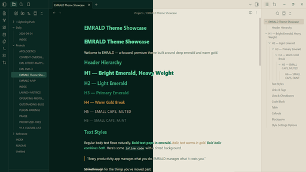
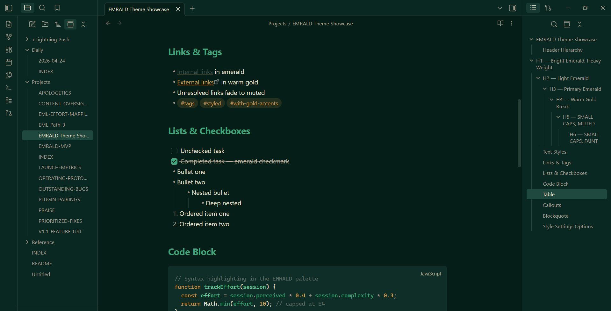
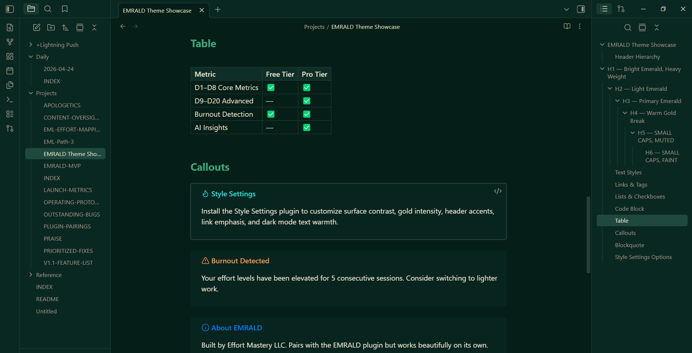
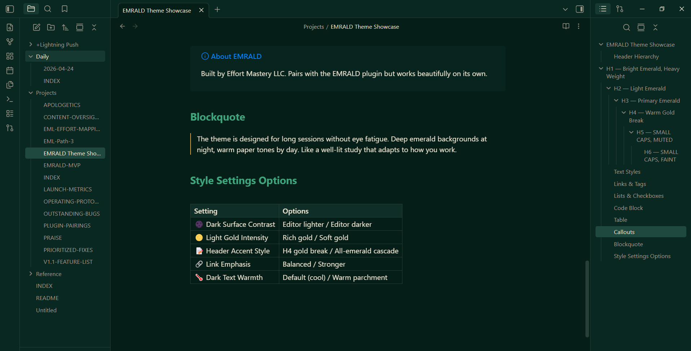
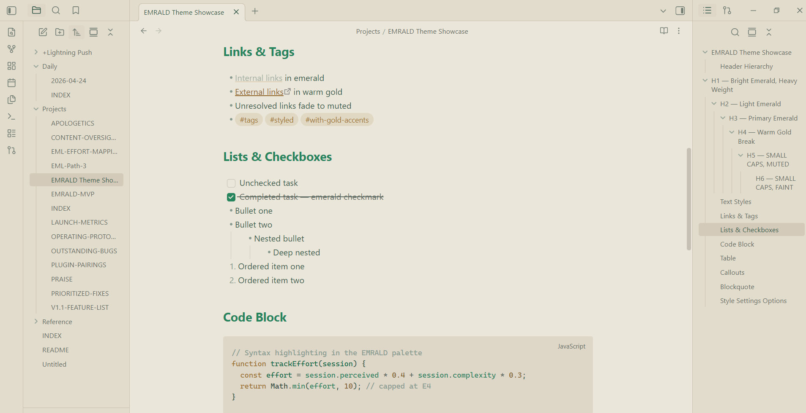
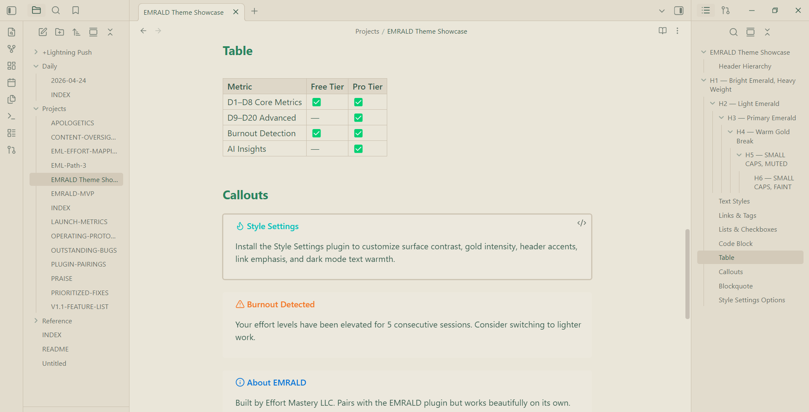
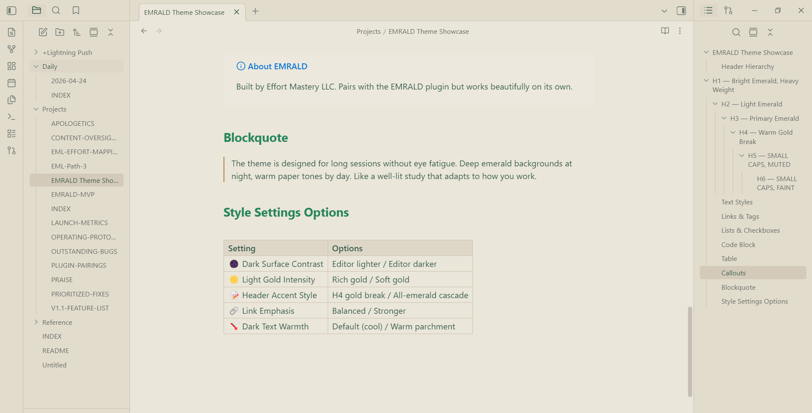

# EMRALD Theme for Obsidian

A focused, premium theme built around deep emerald and warm gold — like a well-lit study at night, or sun-warmed parchment by day.

## Dark Mode

Deep emerald backgrounds with bright emerald and warm gold accents. Designed for long sessions without eye fatigue.

## Light Mode

Warm paper tones with dark emerald text and subtle gold highlights. Feels like writing on quality stationery.

## Features

- Full dark and light mode with curated palettes
- Syntax highlighting (CodeMirror 6) in emerald/gold
- Styled blockquotes, callouts, tables, and horizontal rules
- Emerald-tinted inline code blocks
- Readable toast/notice messages in both modes
- Stepped header hierarchy with weight + color distinction

## Style Settings

Requires the [Style Settings](https://github.com/mgmeyers/obsidian-style-settings) plugin for customization.

| Setting | Options | Description |
|---|---|---|
| Dark Mode Surface Contrast | Editor lighter / Editor darker | Swap which surface feels deeper |
| Light Mode Gold Intensity | Rich gold / Soft gold | Dial back the warm gold accents |
| Header Accent Style | H4 gold break / All-emerald | Keep the gold H4 or go full emerald |
| Link Emphasis | Balanced / Stronger | Increase link visibility |
| Dark Mode Text Warmth | Default (cool) / Warm parchment | Soften dark-mode text to a warm cream |

## Installation

1. Open Obsidian **Settings → Appearance**
2. Under **Themes**, click **Manage**
3. Search for **EMRALD**
4. Click **Install and use**

## Manual Installation

1. Download `theme.css` and `manifest.json` from the [latest release](../../releases/latest)
2. Create a folder called `EMRALD` inside your vault's `.obsidian/themes/` directory
3. Place both files inside
4. Open Obsidian **Settings → Appearance** and select **EMRALD**

## About

EMRALD is built by [Effort Mastery LLC](https://effortmastery.com), the team behind the [EMRALD Obsidian plugin](https://getemrald.com) — an effort management system that tracks what your work actually costs you.

The theme pairs naturally with the plugin but works beautifully on its own.

## License

[MIT](LICENSE)
